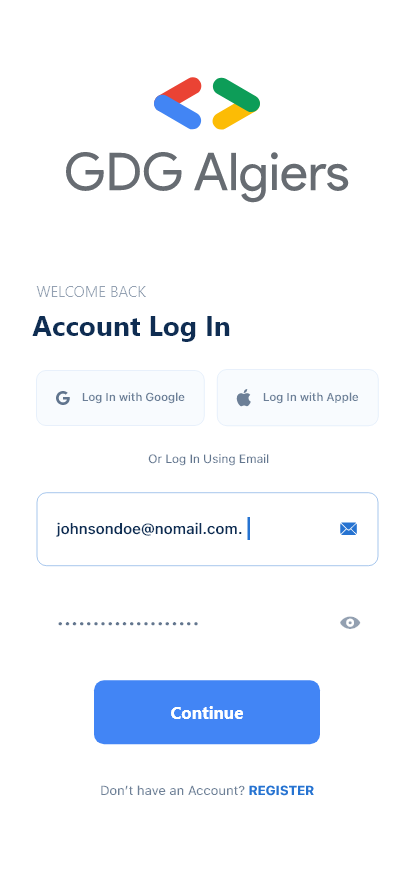
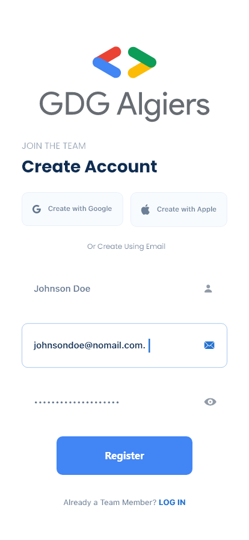
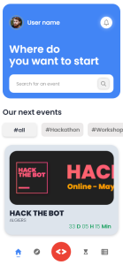
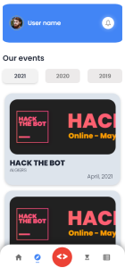

# this project is just for integrate new members in GDG Algeirs 


<hr>
<link href="https://fonts.googleapis.com/css2?family=Poppins:wght@300&display=swap" rel="stylesheet">
<p align="center">
  </img>
  <h1 align="center"  style="font-family:'Poppins'">
  GDG EVENTS


</h1>
<hr>
</p>


|#|<h3 style ="font-family:Poppins" >Table of contents</h3> |
|:--:|:---------------------------:|
|1| [What it's all about](#what-its-all-about)|
|2|[Why Events app ?](#why-events-app)|
|3| [Technologies used](#technologies-used)|
|4| [Project Demonstration](#project-demonstration)|
|5|[Test it](#test-it)|
|6|[Team Members](#team-members)|


## What it's all about
>* **GDG EVENTS** app will host every **GDG ALGIERS** previous and upcoming event.
>* Each and every event will have it’s own respectful <u>description</u>, its <u>speakers/mentors</u>, a <u>countdown</u> and a <u>registration form</u> (If it’s upcoming event).
>* The event’s dedicated <u>photo gallery</u>, It’s <u>location</u> and the event’s <u>agenda</u>. 
>* **The organizers** will be shouted out , It will also feature a <u>feedback</u> section.

## Why Events app?
* _**Why** creating a GDG events application ?_ _**What** problems we can solve with it?_ You can ask this question, well the answer is as follows, we have worked to make event announcement easy for all types of users and publishers. And the amazing thing that we did is we added the gallery feature that the user can see past events, amazing moments and motivation to attend one of those events.

## Technologies used
* This application created using 


## Project Demonstration
  * ### Screens
    1. **Login/SignIn Page**
  
    |Login Page|
    |:--:|
    |
    |Sign In Page|
    ||
    2. **Home Page**
    
    ||
    |:--:|
    ||
    1. **PastEvents Page**
    
    ||
    |:--:|
    ||
    1. **Galery Page**
   
    ||
    |:--:|
    ||


## Test it
1. First let assume that you already have flutter if not go [Here](https://docs.flutter.dev/get-started/install)
2. Clone the repo
   ```bash
   git clone https://github.com/abdelghanimeliani/gdg-events-app.git
   ```
3. cd into the repo then run it using **flutter CLI**
   ```bash
   cd gdg-events-app
   flutter run -d <your-emulator-name>
   ```


## Team Members

- [Ayoub Kezzoula](https://github.com/AyoubKezzoula)
- [Yahia Ilyes](https://github.com/ilyes-d)
- [Marouane Benbetka](https://github.com/MarouaneBenbetka)
- [Rafik DOUHA](https://github.com/rafaucoin)


